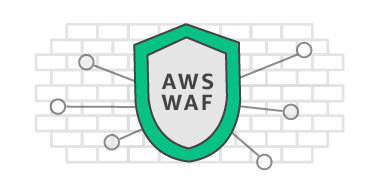

# Complete AWS WAF (Web Application Firewall) Automation with Terraform (Regional / Global)

<p>
  
  <a href="LICENSE">
    
  </a>
  <a href="https://twitter.com/fidelissauro">
    
  </a>
</p>




## Features (Roadmap)

*   Feature Flag :x:
*   Global Mode Rules Replication from Regional Rules (For Cloudfront)
*   Blacklist IP's :white_check_mark:
*   SQL Injection protection :white_check_mark:
*   XSS protection :white_check_mark:
*   DDoS protection (IP Rated) :white_check_mark:
*   Generic insecure patterns for Querystrings :white_check_mark:
*   Generic insecure patterns for URI :white_check_mark:
*   Generic insecure patterns for BODY :x:
*   Regex pattern for BODY :white_check_mark:
*   Regex pattern for URI :white_check_mark:
*   Regex pattern for HEADER :x:
*   Monitoring with Kinesis and Elasticsearch and Kibana :x:
*   Elasticsearch Log Retention :x:


## Install

```sh
terraform init
terraform apply
```


## Author

👤 **Matheus Fidelis**

* Twitter: [@fidelissauro](https://twitter.com/fidelissauro)
* Github: [@msfidelis](https://github.com/msfidelis)

## 🤝 Contributing

Contributions, issues and feature requests are welcome!<br />Feel free to check [issues page](/issues).

## Show your support

Give a ⭐️ if this project helped you!

## 📝 License

Copyright © 2019 [Matheus Fidelis](https://github.com/msfidelis).<br />
This project is [MIT](LICENSE) licensed.

***